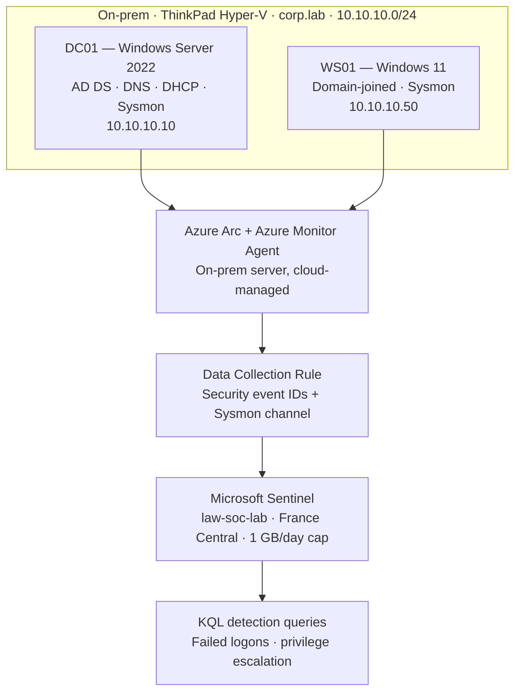

# Hybrid SOC Lab — On-Prem Active Directory into Microsoft Sentinel

A self-built, hybrid Security Operations lab. An on-premises Windows Active Directory
domain runs on local hardware and ships its security and endpoint telemetry into
**Microsoft Sentinel** (a cloud SIEM) via **Azure Arc** and the **Azure Monitor Agent**.
Staged attacks are then hunted in the SIEM with **KQL**.

The lab is built to be reproducible, threat-informed, and documented to a professional
standard — not a single-box tutorial. It is an active, growing project; see the
[Roadmap](#roadmap) for what is built versus what is planned.

---

## Status

| Stage | Description | State |
|------|-------------|:-----:|
| Phase 1 | On-prem Active Directory core (DC + client + Sysmon) | ✅ Complete |
| Phase 2 | Cloud SIEM pipeline (Arc → AMA → DCR → Sentinel → KQL) | ✅ Complete |
| Step 5 | Hybrid identity (Entra Connect to a personal Entra tenant) | ⏳ Planned |
| Step 6 | Detections-as-code (saved analytics rules, Sigma → KQL) | ⏳ Planned |
| Phase 3 | Identity security (Conditional Access, PIM, Identity Protection) | ⏳ Planned |
| Stage 4 | Threat-informed adversary emulation + ATT&CK coverage | ⏳ Planned |

---

## Contents

- [Architecture](#architecture)
- [Environment](#environment)
- [Build](#build)
  - [Phase 1 — On-prem Active Directory](#phase-1--on-prem-active-directory)
  - [Phase 2 — Cloud SIEM pipeline](#phase-2--cloud-siem-pipeline)
- [What I detected](#what-i-detected)
- [Obstacles and decisions](#obstacles-and-decisions)
- [Framework mapping](#framework-mapping)
- [ATT&CK techniques staged](#attck-techniques-staged)
- [Skills demonstrated](#skills-demonstrated)
- [Roadmap](#roadmap)
- [Repository structure](#repository-structure)

---

## Architecture

Telemetry flows from the on-premises domain, up through Azure Arc and the Azure Monitor
Agent, is filtered by a Data Collection Rule, ingested into Microsoft Sentinel, and
queried with KQL.



**Data flow in one line:** on-prem security events and Sysmon telemetry → Azure Arc
makes the DC cloud-manageable → the Azure Monitor Agent collects per the Data Collection
Rule → events land in the Sentinel Log Analytics workspace → KQL surfaces the attacks.

---

## Environment

| Component | Detail |
|-----------|--------|
| Hypervisor | Hyper-V (Generation 2 VMs) on Windows 11 Pro |
| Host | Lenovo ThinkPad X1 Carbon, Intel i7-8650U, 16 GB RAM |
| Domain controller | `DC01` — Windows Server 2022, AD DS / DNS / DHCP, `10.10.10.10` |
| Workstation | `WS01` — Windows 11, domain-joined, DHCP-assigned `10.10.10.50` |
| Domain | `corp.lab` (NetBIOS `CORP`) |
| Lab network | Hyper-V internal switch + NAT, `10.10.10.0/24` (isolated by default) |
| Endpoint telemetry | Sysmon (community configuration) on both hosts |
| Cloud | Azure (France Central) — Log Analytics, Microsoft Sentinel, Azure Arc |
| Funding | Azure for Students credit; Sentinel free trial + 1 GB/day ingestion cap |

> The lab is network-isolated. All offensive activity is adversary *emulation* performed
> against infrastructure I own, to build detections — not capability for misuse.

---

## Build

> Commands below are representative of the build. Secrets and credentials are shown as
> placeholders and were never committed.

### Phase 1 — On-prem Active Directory

**Hyper-V and an isolated lab network (host, elevated PowerShell):**

```powershell
Enable-WindowsOptionalFeature -Online -FeatureName Microsoft-Hyper-V -All

New-VMSwitch -SwitchName "LAB" -SwitchType Internal
New-NetIPAddress -IPAddress 10.10.10.1 -PrefixLength 24 -InterfaceAlias "vEthernet (LAB)"
New-NetNat -Name "LAB-NAT" -InternalIPInterfaceAddressPrefix "10.10.10.0/24"
```

**Promote DC01 and create the domain (inside DC01):**

```powershell
New-NetIPAddress -IPAddress 10.10.10.10 -PrefixLength 24 -DefaultGateway 10.10.10.1 -InterfaceAlias "Ethernet"
Set-DnsClientServerAddress -InterfaceAlias "Ethernet" -ServerAddresses 127.0.0.1
Rename-Computer -NewName "DC01" -Restart

Install-WindowsFeature AD-Domain-Services -IncludeManagementTools
Install-ADDSForest -DomainName "corp.lab" -DomainNetbiosName "CORP" -InstallDns -Force
Add-DnsServerForwarder -IPAddress 1.1.1.1
```

**DHCP for the lab network:**

```powershell
Install-WindowsFeature DHCP -IncludeManagementTools
Add-DhcpServerv4Scope -Name "LAB" -StartRange 10.10.10.50 -EndRange 10.10.10.100 -SubnetMask 255.255.255.0
Set-DhcpServerv4OptionValue -DnsServer 10.10.10.10 -Router 10.10.10.1 -DnsDomain "corp.lab"
Add-DhcpServerInDC
```

**Join WS01 to the domain (inside WS01):**

```powershell
Add-Computer -DomainName "corp.lab" -Credential CORP\Administrator -Restart
```

**Deploy Sysmon on both hosts** (community config for detection-grade telemetry):

```powershell
.\Sysmon64.exe -accepteula -i sysmonconfig.xml
```

### Phase 2 — Cloud SIEM pipeline

**Workspace, Sentinel, and a cost cap (host, Azure CLI).** Built via CLI after a
subscription policy blocked portal region selection — see
[Obstacles](#obstacles-and-decisions).

```powershell
$LOC = "francecentral"
az group create -n rg-soc-lab -l $LOC
az monitor log-analytics workspace create -g rg-soc-lab -n law-soc-lab -l $LOC

# Enable Microsoft Sentinel on the workspace, then cap ingestion at 1 GB/day
az monitor log-analytics workspace update -g rg-soc-lab -n law-soc-lab --set workspaceCapping.dailyQuotaGb=1
```

**Azure Arc-enable DC01** (register providers on the host, then connect from inside DC01):

```powershell
az provider register --namespace Microsoft.HybridCompute
az provider register --namespace Microsoft.HybridConnectivity
az provider register --namespace Microsoft.GuestConfiguration
```

```powershell
# Inside DC01 — install and connect the Connected Machine agent
Invoke-WebRequest -UseBasicParsing -Uri "https://aka.ms/azcmagent-windows" -OutFile "$env:TEMP\install_azcmagent.ps1"
& "$env:TEMP\install_azcmagent.ps1"

& "$env:ProgramFiles\AzureConnectedMachineAgent\azcmagent.exe" connect `
  --subscription-id "<SUBSCRIPTION_ID>" `
  --resource-group "rg-soc-lab" `
  --tenant-id "<TENANT_ID>" `
  --location "francecentral"
```

**Data Collection Rule** routing Windows Security events to the parsed `SecurityEvent`
table and Sysmon to the `Event` table. Two data flows in one rule, deployed as code:

```jsonc
{
  "location": "francecentral",
  "properties": {
    "dataSources": {
      "windowsEventLogs": [
        {
          "name": "securityEvents",
          "streams": ["Microsoft-SecurityEvent"],
          "xPathQueries": [
            "Security!*[System[(EventID=4624 or EventID=4625 or EventID=4634 or EventID=4648 or EventID=4672 or EventID=4720 or EventID=4722 or EventID=4724 or EventID=4728 or EventID=4732 or EventID=4737 or EventID=4738 or EventID=4756 or EventID=4768 or EventID=4769 or EventID=4770 or EventID=4771 or EventID=4776 or EventID=7045)]]",
            "Microsoft-Windows-PowerShell/Operational!*[System[(EventID=4104)]]"
          ]
        },
        {
          "name": "sysmonEvents",
          "streams": ["Microsoft-Event"],
          "xPathQueries": ["Microsoft-Windows-Sysmon/Operational!*[System]"]
        }
      ]
    },
    "destinations": {
      "logAnalytics": [
        { "workspaceResourceId": "<WORKSPACE_RESOURCE_ID>", "name": "laDest" }
      ]
    },
    "dataFlows": [
      { "streams": ["Microsoft-SecurityEvent"], "destinations": ["laDest"] },
      { "streams": ["Microsoft-Event"], "destinations": ["laDest"] }
    ]
  }
}
```

Why these event IDs: they cover the behaviours staged in this lab — brute force
(`4625`/`4771`), privileged logon (`4672`), account creation and privileged-group
membership (`4720`/`4728`), Kerberos and NTLM authentication (`4768`/`4769`/`4776`),
service installation (`7045`), and PowerShell script-block logging (`4104`) — while
keeping ingestion volume small.

---

## What I detected

A small attack was staged on DC01 and then hunted in Sentinel.

**The staged activity**
- A burst of failed authentications against the `sahmed` account (brute-force simulation).
- Creation of a rogue account (`tanalyst`) and its addition to **Domain Admins** (persistence).
- PowerShell and process activity for endpoint telemetry.

**Hunting the brute-force burst (KQL):**

```kql
SecurityEvent
| where TimeGenerated > ago(1h)
| where EventID == 4625
| summarize FailedAttempts = count() by Account, Computer
| sort by FailedAttempts desc
```

**Hunting the persistence move:**

```kql
SecurityEvent
| where TimeGenerated > ago(1h)
| where EventID in (4720, 4728)
| project TimeGenerated, EventID, Activity, Account
| sort by TimeGenerated asc
```

**Analyst bird's-eye view — what arrived and how much:**

```kql
SecurityEvent
| where TimeGenerated > ago(1h)
| summarize Count = count() by EventID
| sort by Count desc
```

Confirmed populated in `SecurityEvent`: `4624`, `4672`, `4634`, `4648`, `4625`, `4104`,
plus the `4720`/`4728` persistence events — the full attack narrative, queryable in the
cloud SIEM.

> Add screenshots of the KQL output to `docs/` and reference them here as evidence
> (e.g. ``).

---

## Obstacles and decisions

Real obstacles, documented as engineering decisions rather than hidden.

- **Azure for Students region policy.** The subscription is restricted by Azure Policy to
  five regions (`italynorth`, `francecentral`, `germanywestcentral`, `spaincentral`,
  `swedencentral`). The portal region dropdown does not filter to these, so every "obvious"
  region failed. Diagnosed by reading the policy assignment's allowed-locations parameter,
  then provisioned everything via Azure CLI in France Central.

- **Domain-controller Kerberos logon events.** Failed logons against a domain account on a
  DC frequently surface as Kerberos pre-authentication failures (`4771`) rather than `4625`.
  The DCR was widened to collect both so brute-force activity is captured reliably on a DC.

- **DCR stream mapping.** An initial rule shipped only Sysmon (`Event` table) and not the
  Windows Security channel. Diagnosed by validating event generation at source with
  `Get-WinEvent`, then redeployed the rule as code with an explicit `Microsoft-SecurityEvent`
  stream so events land in the parsed `SecurityEvent` table.

- **Identity work belongs in a separate tenant.** The Azure for Students subscription lives
  in the university's Entra tenant, where I hold no admin rights. Hybrid identity and
  identity-security work (Entra Connect, Conditional Access, PIM) will be done in a
  separate personal Entra tenant — the correct place to practise privileged-access controls.

---

## Framework mapping

| Framework | Control area addressed |
|-----------|------------------------|
| NIST CSF 2.0 | **DE.CM** continuous monitoring; **DE.AE** adverse event analysis; **ID.AM** asset inventory (Arc) |
| CIS Controls v8 | **1** inventory; **6** access control; **8** audit log management |
| NCSC CAF | **C1** security monitoring; **B2** identity and access (partial) |
| ISO/IEC 27001 (Annex A) | **A.8.15** logging; **A.8.16** monitoring activities; **A.5.15** access control |

---

## ATT&CK techniques staged

Techniques *emulated* in this lab so far (not a full coverage assessment):

| Technique | ID | Where |
|-----------|----|-------|
| Brute Force | T1110 | Failed-logon burst against `sahmed` |
| Create Account: Domain Account | T1136.002 | Creation of `tanalyst` |
| Account Manipulation / Valid Accounts | T1098 / T1078.002 | `tanalyst` added to Domain Admins |
| Command and Scripting Interpreter: PowerShell | T1059.001 | Script-block-logged activity |
| Event Triggered Execution: Accessibility Features | T1546.008 | Utilman credential-recovery (build phase) |

---

## Skills demonstrated

Microsoft Sentinel · Log Analytics · KQL · Azure Arc · Azure Monitor Agent ·
Data Collection Rules · Sysmon · Windows Active Directory (AD DS, DNS, DHCP) ·
Hyper-V virtualisation · Azure CLI · PowerShell · detection engineering ·
SIEM cost control · MITRE ATT&CK.

Doubles as hands-on preparation for **SC-200** and **AZ-500**.

---

## Roadmap

- **Hybrid identity** — create a personal Entra ID tenant and sync `corp.lab` via Entra Connect.
- **Detections-as-code** — convert the KQL above into saved Sentinel analytics rules; author Sigma rules in version control and convert to KQL.
- **Identity security** — Conditional Access, MFA, Privileged Identity Management, Identity Protection.
- **Adversary emulation** — Atomic Red Team / Caldera mapped to MITRE ATT&CK, with an ATT&CK Navigator coverage heatmap.
- **Infrastructure-as-code** — redeploy the cloud components with Bicep or Terraform.

---

## Repository structure

```text
hybrid-soc-lab/
├── README.md
├── docs/                 # screenshots, architecture exports
├── build/
│   ├── phase1-ad/        # AD / DHCP / DNS / Sysmon scripts
│   └── phase2-sentinel/  # az CLI, DCR JSON
├── detections/
│   └── kql/              # hunting queries (future: Sigma rules)
└── attack/
    └── staging/          # emulation scripts (lab-isolated)
```

---

*Built and documented as a portfolio project. All activity was performed on isolated
infrastructure I own, for defensive and educational purposes.*
