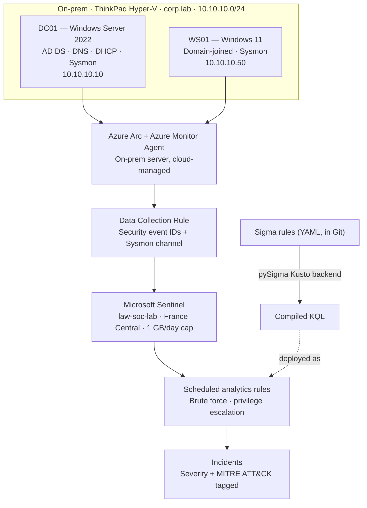

# Hybrid SOC Lab — On-Prem Active Directory into Microsoft Sentinel

A self-built, hybrid Security Operations lab. An on-premises Windows Active Directory
domain runs on local hardware and streams its security and endpoint telemetry into
**Microsoft Sentinel** (a cloud SIEM) via **Azure Arc** and the **Azure Monitor Agent**.
Staged attacks are detected with scheduled analytics rules, and detections are managed
**as code** with Sigma compiled to KQL.

Built to be reproducible, threat-informed and documented to a professional standard —
not a single-box tutorial. It is an active, growing project; see the [Roadmap](#roadmap)
for what is built versus planned.

---

## Status

| Stage | Description | State |
|------|-------------|:-----:|
| Phase 1 | On-prem Active Directory core (DC + client + Sysmon) | ✅ Complete |
| Phase 2 | Cloud SIEM pipeline (Arc → AMA → DCR → Sentinel → KQL) | ✅ Complete |
| Phase 2 | Detection engineering (analytics rules + detection-as-code) | ✅ Complete |
| Phase 2 | Hybrid identity (Entra Connect) | ⛔ Parked — needs personal Entra tenant |
| Next | Purple-team adversary emulation + ATT&CK coverage heatmap | ⏳ Planned |
| Phase 3 | Identity security (Conditional Access, PIM, Identity Protection) | ⏳ Planned (depends on hybrid identity) |
| Future | Infrastructure-as-code (Bicep / Terraform) | ⏳ Planned |

> **Parked, not failed:** the Azure for Students subscription lives in the university's
> Entra tenant where I hold no admin rights, and creating a separate tenant is gated
> behind a paid-customer / subscription requirement. Hybrid identity and identity-security
> work will resume in a dedicated personal Entra tenant — the correct place to practise
> privileged-access controls.

---

## Contents

- [Architecture](#architecture)
- [Environment](#environment)
- [Build](#build)
  - [Phase 1 — On-prem Active Directory](#phase-1--on-prem-active-directory)
  - [Phase 2 — Cloud SIEM pipeline](#phase-2--cloud-siem-pipeline)
  - [Phase 2 — Detection engineering](#phase-2--detection-engineering)
- [Detections](#detections)
- [Detection-as-code](#detection-as-code)
- [Obstacles and decisions](#obstacles-and-decisions)
- [Framework mapping](#framework-mapping)
- [ATT&CK techniques](#attck-techniques)
- [Skills demonstrated](#skills-demonstrated)
- [Roadmap](#roadmap)
- [Repository structure](#repository-structure)

---

## Architecture

Telemetry flows from the on-premises domain, up through Azure Arc and the Azure Monitor
Agent, is filtered by a Data Collection Rule, ingested into Microsoft Sentinel, and turned
into incidents by scheduled analytics rules. Detections are authored as Sigma and compiled
to KQL.


```mermaid
flowchart TD
  subgraph ONPREM["On-prem · ThinkPad Hyper-V · corp.lab · 10.10.10.0/24"]
    DC["DC01 — Windows Server 2022<br/>AD DS · DNS · DHCP · Sysmon<br/>10.10.10.10"]
    WS["WS01 — Windows 11<br/>Domain-joined · Sysmon<br/>10.10.10.50"]
  end
  DC --> ARC["Azure Arc + Azure Monitor Agent<br/>On-prem server, cloud-managed"]
  WS --> ARC
  ARC --> DCR["Data Collection Rule<br/>Security event IDs + Sysmon channel"]
  DCR --> SENT["Microsoft Sentinel<br/>law-soc-lab · France Central · 1 GB/day cap"]
  SENT --> RULES["Scheduled analytics rules<br/>Brute force · privilege escalation"]
  RULES --> INC["Incidents<br/>Severity + MITRE ATT&CK tagged"]

  SIGMA["Sigma rules (YAML, in Git)"] -->|pySigma Kusto backend| KQL["Compiled KQL"]
  KQL -.deployed as.-> RULES
```

**Data flow in one line:** on-prem security + Sysmon telemetry → Azure Arc makes the DC
cloud-manageable → the Azure Monitor Agent collects per the Data Collection Rule → events
land in Sentinel → scheduled analytics rules raise incidents → detections are version-
controlled as Sigma and compiled to KQL.

---

## Environment
[Screenshot 2026-06-24 134119.png
](https://github.com/ak24ajb/microsoft-sentinel-hybrid-homelab/blob/screenshots/Screenshot%202026-06-24%20134119.png)| Component | Detail |
|-----------|--------|
| Hypervisor | Hyper-V (Generation 2 VMs) on Windows 11 Pro |
| Host | Lenovo ThinkPad X1 Carbon, Intel i7-8650U, 16 GB RAM |
| Domain controller | `DC01` — Windows Server 2022, AD DS / DNS / DHCP, `10.10.10.10` |
| Workstation | `WS01` — Windows 11, domain-joined, `10.10.10.50` |
| Domain | `corp.lab` (NetBIOS `CORP`) |
| Lab network | Hyper-V internal switch + NAT, `10.10.10.0/24` (isolated by default) |
| Endpoint telemetry | Sysmon (community configuration) on both hosts |
| Cloud | Azure (France Central) — Log Analytics, Microsoft Sentinel, Azure Arc |
| Detection-as-code | Sigma (YAML) → KQL via `pysigma-backend-kusto` (`azure_monitor` pipeline) |
| Funding | Azure for Students; Sentinel free trial + 1 GB/day ingestion cap |

> The lab is network-isolated. All offensive activity is adversary *emulation* against
> infrastructure I own, to build detections — not capability for misuse.

---

## Build

> Commands below are representative. Secrets are shown as placeholders and were never committed.

### Phase 1 — On-prem Active Directory

```powershell
# Hyper-V + isolated lab network (host)
Enable-WindowsOptionalFeature -Online -FeatureName Microsoft-Hyper-V -All
New-VMSwitch -SwitchName "LAB" -SwitchType Internal
New-NetIPAddress -IPAddress 10.10.10.1 -PrefixLength 24 -InterfaceAlias "vEthernet (LAB)"
New-NetNat -Name "LAB-NAT" -InternalIPInterfaceAddressPrefix "10.10.10.0/24"

# Promote DC01 + create the domain (inside DC01)
Install-WindowsFeature AD-Domain-Services -IncludeManagementTools
Install-ADDSForest -DomainName "corp.lab" -DomainNetbiosName "CORP" -InstallDns -Force
Add-DnsServerForwarder -IPAddress 1.1.1.1

# DHCP for the lab network
Install-WindowsFeature DHCP -IncludeManagementTools
Add-DhcpServerv4Scope -Name "LAB" -StartRange 10.10.10.50 -EndRange 10.10.10.100 -SubnetMask 255.255.255.0
Add-DhcpServerInDC

# Join WS01 to the domain (inside WS01)
Add-Computer -DomainName "corp.lab" -Credential CORP\Administrator -Restart

# Sysmon on both hosts (community config)
.\Sysmon64.exe -accepteula -i sysmonconfig.xml
```

### Phase 2 — Cloud SIEM pipeline

```powershell
# Workspace + Sentinel + cost cap, via Azure CLI (portal region selection blocked by policy)
$LOC = "francecentral"
az group create -n rg-soc-lab -l $LOC
az monitor log-analytics workspace create -g rg-soc-lab -n law-soc-lab -l $LOC
az monitor log-analytics workspace update -g rg-soc-lab -n law-soc-lab --set workspaceCapping.dailyQuotaGb=1

# Azure Arc-enable DC01 (inside DC01)
& "$env:ProgramFiles\AzureConnectedMachineAgent\azcmagent.exe" connect `
  --subscription-id "<SUBSCRIPTION_ID>" --resource-group "rg-soc-lab" `
  --tenant-id "<TENANT_ID>" --location "francecentral"
```

The Data Collection Rule routes Windows Security events to the parsed `SecurityEvent`
table and Sysmon to the `Event` table (two data flows, deployed as code). Collected
security event IDs cover brute force (`4625`/`4771`), privileged logon (`4672`), account
creation and privileged-group membership (`4720`/`4728`/`4732`/`4756`), Kerberos and NTLM
authentication (`4768`/`4769`/`4776`), service installation (`7045`) and PowerShell
script-block logging (`4104`) — scoped to keep ingestion volume small.

### Phase 2 — Detection engineering

- **Azure Activity** connector enabled (subscription-scoped) for control-plane monitoring.
- **Two scheduled analytics rules** authored with entity mapping and MITRE ATT&CK tagging
  (see [Detections](#detections)).
- **Detection-as-code** workflow established: Sigma rules in Git compiled to KQL with the
  pySigma Kusto backend (see [Detection-as-code](#detection-as-code)).

---

## Detections

Scheduled analytics rules that run automatically and raise incidents. Incident generation
was verified by re-running the staged attacks after the rules were enabled.

**Brute Force — Failed Logon Burst** · Severity Medium · MITRE **T1110**

```kql
SecurityEvent
| where EventID == 4625
| summarize FailedAttempts = count(),
            TargetAccounts = make_set(TargetUserName, 10),
            StartTime = min(TimeGenerated), EndTime = max(TimeGenerated)
    by Computer
| where FailedAttempts >= 5
```

**Persistence — User Added to Privileged Group** · Severity High · MITRE **T1098 / T1078.002**

```kql
SecurityEvent
| where EventID in (4728, 4732, 4756)
| where TargetUserName has_any ("Domain Admins", "Enterprise Admins", "Schema Admins", "Administrators")
| project TimeGenerated, Computer, Activity,
          ActorAccount = SubjectUserName, AddedMember = MemberName,
          PrivilegedGroup = TargetUserName
```

Both rules use entity mapping (Host / Account) so Sentinel builds an investigation graph
and correlates incidents to the affected assets.

> Add screenshots of a fired incident to `docs/` and reference here as evidence.

---

## Detection-as-code

Detections are authored once as vendor-neutral **Sigma** (YAML), version-controlled, and
compiled to Sentinel KQL — the source of truth is the Sigma rule; the KQL is a build artifact.

```bash
pip install sigma-cli pysigma-backend-kusto
sigma convert -t kusto -p azure_monitor detections/sigma/windows/privileged-group-add.yml
```

Example rule — `detections/sigma/windows/privileged-group-add.yml`:

```yaml
title: User Added to Privileged Active Directory Group
status: experimental
description: Detects a user account being added to a privileged AD group (e.g. Domain Admins).
references:
  - https://attack.mitre.org/techniques/T1098/
tags:
  - attack.persistence
  - attack.privilege_escalation
  - attack.t1098
  - attack.t1078.002
logsource:
  product: windows
  service: security
detection:
  selection:
    EventID: [4728, 4732, 4756]
    TargetUserName: ['Domain Admins', 'Enterprise Admins', 'Schema Admins']
  condition: selection
falsepositives:
  - Legitimate onboarding of new IT administrators
level: high
```

**Pipeline note:** because the data lives in the Log Analytics `SecurityEvent` table, the
`azure_monitor` pipeline is required. The `microsoft_xdr` pipeline compiles against Defender
advanced-hunting tables that this lab does not have and would silently match nothing.

---

## Obstacles and decisions

Real obstacles, documented as engineering decisions.

- **Azure for Students region policy.** The subscription is restricted by Azure Policy to
  five regions (`italynorth`, `francecentral`, `germanywestcentral`, `spaincentral`,
  `swedencentral`); the portal region dropdown does not filter to these. Diagnosed by reading
  the policy assignment's allowed-locations parameter and provisioned via Azure CLI in France Central.
- **Domain-controller Kerberos logon events.** Failed logons against a domain account on a DC
  frequently surface as Kerberos pre-authentication failures (`4771`) rather than `4625`. The
  DCR was widened to collect both.
- **DCR stream mapping.** An initial rule shipped only Sysmon and not the Windows Security
  channel. Diagnosed by validating event generation at source with `Get-WinEvent`, then
  redeployed the rule as code with an explicit `Microsoft-SecurityEvent` stream.
- **Tenant / identity governance.** The subscription lives in the university's Entra tenant
  with no admin rights, and separate-tenant creation is gated. Hybrid identity is deferred to
  a dedicated personal tenant rather than worked around — the correct place for privileged-access practice.
- **Sigma backend rename.** The pySigma Microsoft 365 Defender backend was renamed to the
  Kusto backend; most public tutorials reference the deprecated name and the wrong pipeline.

---

## Framework mapping

| Framework | Control area addressed |
|-----------|------------------------|
| NIST CSF 2.0 | **DE.CM** continuous monitoring; **DE.AE** adverse event analysis; **ID.AM** asset inventory (Arc) |
| CIS Controls v8 | **1** inventory; **6** access control; **8** audit log management |
| NCSC CAF | **C1** security monitoring; **C2** proactive event discovery; **B2** identity and access (partial) |
| ISO/IEC 27001 (Annex A) | **A.8.15** logging; **A.8.16** monitoring activities; **A.5.15** access control |

---

## ATT&CK techniques

Techniques staged in this lab, and whether a detection exists for them:

| Technique | ID | Detection |
|-----------|----|:---------:|
| Brute Force | T1110 | ✅ Analytics rule |
| Account Manipulation / Valid Accounts | T1098 / T1078.002 | ✅ Analytics rule + Sigma |
| Create Account: Domain Account | T1136.002 | Telemetry collected (rule pending) |
| Command and Scripting Interpreter: PowerShell | T1059.001 | Telemetry collected (4104) |
| Event Triggered Execution: Accessibility Features | T1546.008 | Observed (build phase) |

> A full ATT&CK Navigator coverage heatmap will be produced during the adversary-emulation phase.

---

## Skills demonstrated

Microsoft Sentinel · Log Analytics · KQL · scheduled analytics rules · incident triage ·
entity mapping · detection engineering · **detection-as-code (Sigma → KQL, pySigma)** ·
Azure Arc · Azure Monitor Agent · Data Collection Rules · Sysmon · MITRE ATT&CK ·
Windows Active Directory (AD DS, DNS, DHCP) · Hyper-V · Azure CLI · PowerShell · SIEM cost control.

Doubles as hands-on preparation for **SC-200** and **AZ-500**.

---

## Roadmap

- **Purple-team adversary emulation** — Atomic Red Team / Caldera mapped to MITRE ATT&CK,
  detections validated, and an ATT&CK Navigator coverage heatmap produced. *(Next.)*
- **Hybrid identity** — personal Entra tenant + Entra Connect (currently parked).
- **Identity security** — Conditional Access, MFA, Privileged Identity Management, Identity Protection.
- **CI/CD for detections** — GitHub Actions to validate and auto-deploy Sigma rules to Sentinel.
- **Infrastructure-as-code** — redeploy the cloud components with Bicep or Terraform.

---

## Repository structure

```text
hybrid-soc-lab/
├── README.md
├── docs/                       # screenshots, architecture exports
├── build/
│   ├── phase1-ad/              # AD / DHCP / DNS / Sysmon scripts
│   └── phase2-sentinel/        # az CLI, DCR JSON
├── detections/
│   ├── sigma/windows/          # source of truth — hand-written Sigma
│   ├── kql/                    # build artifacts — generated from Sigma
│   └── analytics-rules/        # exported Sentinel rule definitions
└── attack/
    └── staging/                # emulation scripts (lab-isolated)
```

---

*Built and documented as a portfolio project. All activity was performed on isolated
infrastructure I own, for defensive and educational purposes.*
